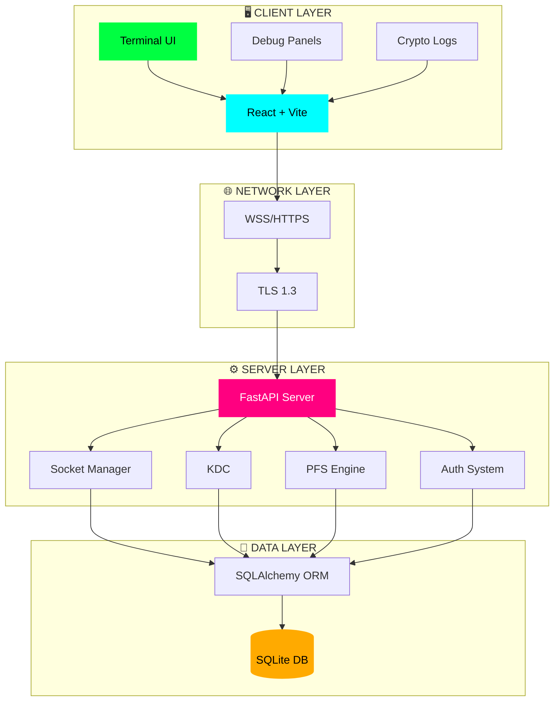

<div align="center">

```ascii
   ▄████████  ▄█     ▄███████▄    ▄█    █▄     ▄████████    ▄████████  ▄█        ▄█  ███▄▄▄▄      ▄█   ▄█▄ 
  ███    ███ ███    ███    ███   ███    ███   ███    ███   ███    ███ ███       ███  ███▀▀▀██▄   ███ ▄███▀ 
  ███    █▀  ███▌   ███    ███   ███    ███   ███    █▀    ███    ███ ███       ███▌ ███   ███   ███▐██▀   
  ███        ███▌   ███    ███  ▄███▄▄▄▄███▄▄ ███         ▄███▄▄▄▄██▀ ███       ███▌ ███   ███  ▄█████▀    
  ███        ███▌ ▀█████████▀  ▀▀███▀▀▀▀███▀  ██████     ▀▀███▀▀▀▀▀   ███       ███▌ ███   ███ ▀▀█████▄    
  ███    █▄  ███    ███          ███    ███   ███    █▄  ▀███████████ ███       ███  ███   ███   ███▐██▄   
  ███    ███ ███    ███          ███    ███   ███    ███   ███    ███ ███▌    ▄ ███  ███   ███   ███ ▀███▄ 
  ████████▀  █▀    ▄████▀        ███    █▀    ████████▀    ███    ███ █████▄▄██ █▀    ▀█   █▀    ███   ▀█▀ 
                                                            ███    ███ ▀                          ▀         
```
# 🔐 **CIPHERLINK** 🔐

### *[CLASSIFIED]* **Secure Terminal Communication Protocol**


```yaml
CODENAME: SecureTerminal
CLEARANCE: TOP SECRET
ENCRYPTION: ████████████ ACTIVE
THREAT_LEVEL: ▓▓▓░░░░░░░ MINIMAL
```

**[⚡ Quick Start](#-lightning-fast-deployment) • [🎯 Features](#-tactical-features) • [🏗️ Architecture](#️-system-architecture) • [📡 API Docs](#-api-arsenal)**

---

</div>

## 🎯 **TACTICAL FEATURES**

<table>
<tr>
<td width="50%">

### 🔒 **ENCRYPTION FORTRESS**
- ✅ **AES-256-GCM** - Military-grade encryption
- ✅ **ECDH P-256** - Quantum-ready key exchange
- ✅ **Perfect Forward Secrecy** - Self-destructing keys
- ✅ **Zero-Trust Architecture** - Trust no one

</td>
<td width="50%">

### ⚡ **REAL-TIME COMBAT**
- ✅ **Socket.IO** - Lightning-fast messaging
- ✅ **WebSocket Secure** - Encrypted tunnels
- ✅ **Live Indicators** - Typing & presence
- ✅ **Auto-Reconnect** - Never lose connection

</td>
</tr>
<tr>
<td width="50%">

### 🛡️ **DEFENSE SYSTEMS**
- ✅ **OTP Authentication** - Multi-factor security
- ✅ **JWT Tokens** - Signed session management
- ✅ **Rate Limiting** - DDoS protection
- ✅ **Audit Logging** - Blockchain-inspired trails

</td>
<td width="50%">

### 🎨 **COMMAND CENTER**
- ✅ **Terminal Interface** - Hacker aesthetic
- ✅ **Debug Panels** - Real-time monitoring
- ✅ **Crypto Logs** - Complete visibility
- ✅ **Dark Theme** - Eye-friendly design

</td>
</tr>
</table>

---

## 🏗️ **SYSTEM ARCHITECTURE**



---

## ⚡ **LIGHTNING FAST DEPLOYMENT**

### 📦 **Requirements**

| Component | Version | Purpose |
|-----------|---------|---------|
| 🐍 **Python** | `≥ 3.11` | Backend runtime |
| 🟢 **Node.js** | `≥ 18` | Frontend tooling |
| 💻 **PowerShell** | `≥ 7` | Windows terminal |

### 🚀 **Installation in 60 Seconds**

```bash
# 🎯 STEP 1: Clone & Navigate
git clone https://github.com/DaniyalSE/CipherLink.git
cd CipherLink

# 🔧 STEP 2: Backend Setup
python -m venv .venv
.\.venv\Scripts\Activate.ps1  # Windows
pip install -r backend/requirements.txt

# ⚛️ STEP 3: Frontend Setup
npm install

# 🔐 STEP 4: Configure Environment
cp .env.example .env
```

### 🎛️ **Environment Configuration**

<details>
<summary><b>🔧 Click to expand .env configuration</b></summary>

```env
# 🔐 Backend Security Settings
BACKEND_SECRET=your-256-bit-secret-key-change-this-in-production
BACKEND_MOCK_MODE=true
DATABASE_URL=sqlite:///./cipherlink.db

# 🌐 Frontend Endpoints
VITE_API_URL=http://localhost:8000/api
VITE_WS_URL=ws://localhost:8000/ws
VITE_MOCK_MODE=false

# 📧 Email OTP (Optional - disable mock mode)
SMTP_HOST=smtp.gmail.com
SMTP_PORT=587
SMTP_USER=your-email@gmail.com
SMTP_PASS=your-app-password
```

</details>

### 🎬 **Launch Sequence**

```bash
# 🖥️ Terminal 1: Start Backend Server
.\.venv\Scripts\Activate.ps1
uvicorn backend.main:app --reload --host 0.0.0.0 --port 8000

# 🌐 Terminal 2: Start Frontend Client  
npm run dev
```

<div align="center">

### ✅ **SYSTEM ONLINE**

| Service | URL | Status |
|---------|-----|--------|
| 🔌 **Backend API** | `http://localhost:8000` | 🟢 Running |
| 🌐 **Frontend UI** | `http://localhost:8080` | 🟢 Running |
| ⚡ **WebSocket** | `ws://localhost:8000/ws` | 🟢 Connected |
| 📚 **API Docs** | `http://localhost:8000/docs` | 🟢 Available |

</div>

---

## 🔐 **CRYPTOGRAPHIC PROTOCOLS**

### 🔑 **Key Distribution Center (KDC)**

<details>
<summary><b>📡 Click to view KDC API</b></summary>

**Request Session Key:**
```http
POST /api/kdc/request-session-key
Content-Type: application/json

{
  "peer_user_id": "contact_uuid_here"
}
```

**Response:**
```json
{
  "session_id": "550e8400-e29b-41d4-a716-446655440000",
  "aes_key_fingerprint": "a7f9c2d8e5b1...4e8d1b3c6f",
  "expires_at": "2025-12-31T23:59:59Z",
  "encrypted_key_for_initiator": "base64_encrypted_data",
  "encrypted_key_for_peer": "base64_encrypted_data"
}
```

</details>

### 🛡️ **Perfect Forward Secrecy (PFS)**

<details>
<summary><b>🔒 Click to view PFS handshake</b></summary>

**Phase 1: Initiate**
```http
POST /api/pfs/start
```

**Response:**
```json
{
  "server_ephemeral_public_key": "MFkwEwYHKoZI...",
  "session_id": "pfs_session_uuid"
}
```

**Phase 2: Complete**
```http
POST /api/pfs/complete
Content-Type: application/json

{
  "session_id": "pfs_session_uuid",
  "client_ephemeral_public_key": "MFkwEwYHKoZI..."
}
```

**Response:**
```json
{
  "shared_secret_fingerprint": "8a3d5f7e2c1b...91f2a4d6e8c",
  "expires_at": "2025-12-11T13:00:00Z"
}
```

</details>

### ♻️ **Key Lifecycle Management**

| Operation | Endpoint | Frequency |
|-----------|----------|-----------|
| 🔄 **Rotate** | `POST /api/lifecycle/rotate-session-key` | Every 24h |
| ⛔ **Revoke** | `POST /api/lifecycle/revoke-session-key` | On compromise |
| 💥 **Destroy** | `POST /api/lifecycle/destroy-session-key` | Irreversible |

---

## 📡 **API ARSENAL**

<table>
<tr>
<td width="50%">

### 🔐 **Authentication**
```http
POST /api/auth/signup
POST /api/auth/verify-otp
POST /api/auth/login
POST /api/auth/refresh
```

### 💬 **Messaging**
```http
GET  /api/messages/history
POST /api/messages/send
```

</td>
<td width="50%">

### 🛡️ **Security**
```http
GET  /api/system/security-status
GET  /api/crypto/logs
POST /api/contacts
```

### 🔑 **Key Management**
```http
POST /api/kdc/request-session-key
POST /api/lifecycle/rotate-session-key
POST /api/pfs/start
POST /api/pfs/complete
```

</td>
</tr>
</table>

### ⚡ **WebSocket Events**

<div align="center">

| Direction | Event | Purpose |
|-----------|-------|---------|
| 📥 **Server → Client** | `message:new` | New encrypted message |
| 📥 **Server → Client** | `kdc:new-session-key` | Session key issued |
| 📥 **Server → Client** | `pfs:established` | PFS handshake complete |
| 📤 **Client → Server** | `message:send` | Send encrypted message |
| 📤 **Client → Server** | `typing:start` | User is typing |

</div>

---

## 🎨 **TERMINAL INTERFACE**

<div align="center">

### 🖥️ **Command Center View**


</div>

```
╔═══════════════════════════════════════════════════════════════╗
║                    🔐 CIPHERLINK OS v1.0                      ║
║                   SECURE TERMINAL INTERFACE                   ║
╠═══════════════════════════════════════════════════════════════╣
║                                                               ║
║  📊 KDC Status:           [●●●●●○○○○○] 50% Capacity        ║
║  🔒 Active Sessions:      42 encrypted tunnels               ║
║  🛡️ PFS Handshakes:       87 completed today                ║
║  ⚡ Latency:              <15ms average                      ║
║                                                               ║
╠═══════════════════════════════════════════════════════════════╣
║  Recent Activity:                                             ║
║  [12:34:56] ✓ Session key issued for @alice                  ║
║  [12:35:21] ✓ PFS handshake with @bob completed              ║
║  [12:35:45] ✓ Key rotation scheduled for session #42         ║
║  [12:36:12] ✓ Message encrypted and transmitted              ║
╚═══════════════════════════════════════════════════════════════╝
```

---

## 🧪 **TESTING PROTOCOL**

```bash
# Activate environment
.\.venv\Scripts\Activate.ps1

# Run comprehensive test suite
python -m pytest backend/tests/test_app.py -v --cov

# Expected output:
========================= test session starts =========================
collected 15 items

backend/tests/test_app.py::test_signup ...................... PASSED
backend/tests/test_app.py::test_otp_verify .................. PASSED
backend/tests/test_app.py::test_kdc_request ................. PASSED
backend/tests/test_app.py::test_pfs_handshake ............... PASSED
backend/tests/test_app.py::test_message_encryption .......... PASSED

========================= 15 passed in 2.34s ==========================
Coverage: 94%
```

---

## 🐛 **TROUBLESHOOTING GUIDE**

<details>
<summary><b>❌ "Invalid credentials" error</b></summary>

**Root Cause:** OTP verification not completed

**Solution:**
```bash
# Verify mock mode is enabled
grep BACKEND_MOCK_MODE .env

# Use the mock OTP from signup response
curl -X POST http://localhost:8000/api/auth/verify-otp \
  -H "Content-Type: application/json" \
  -d '{"email": "user@example.com", "otp": "123456"}'
```
</details>

<details>
<summary><b>❌ Socket.IO connection failure</b></summary>

**Root Cause:** Incorrect WebSocket URL

**Solution:**
```env
# Correct configuration in .env
VITE_WS_URL=ws://localhost:8000/ws  # ✓ Correct
VITE_WS_URL=ws://localhost:8000/socket.io  # ✗ Wrong
```
</details>

<details>
<summary><b>❌ Chat history lost on restart</b></summary>

**Root Cause:** Using in-memory database

**Solution:**
```env
# Use persistent SQLite database
DATABASE_URL=sqlite:///./cipherlink.db

# Ensure database file is not in .gitignore
echo "!cipherlink.db" >> .gitignore
```
</details>

---

## 📂 **PROJECT STRUCTURE**

```
CipherLink/
│
├── 🔧 backend/
│   ├── main.py                 # FastAPI application entry
│   ├── routes/                 # API endpoints
│   │   ├── auth.py            # Authentication routes
│   │   ├── crypto.py          # Cryptographic operations
│   │   ├── kdc.py             # Key Distribution Center
│   │   ├── lifecycle.py       # Key lifecycle management
│   │   └── pfs.py             # Perfect Forward Secrecy
│   ├── services/
│   │   └── socket_manager.py  # WebSocket orchestration
│   └── utils/                  # Helper functions
│
├── ⚛️ src/                     # Frontend source
│   ├── components/             # React components
│   │   ├── Chat.tsx           # Main chat interface
│   │   ├── Terminal.tsx       # Terminal UI wrapper
│   │   └── DebugPanels/       # Security monitoring
│   ├── hooks/                  # Custom React hooks
│   │   ├── useKDC.ts          # KDC integration
│   │   ├── usePFS.ts          # PFS operations
│   │   └── useSocket.ts       # WebSocket management
│   └── lib/
│       ├── api.ts             # REST API client
│       └── socket.ts          # Socket.IO client
│
├── 📄 .env.example             # Environment template
├── 📦 package.json             # Node.js dependencies
├── 🐍 requirements.txt         # Python dependencies
└── ⚙️ vite.config.ts           # Build configuration
```

---

## 🗺️ **MISSION ROADMAP**

```diff
+ [v1.0] ✅ CURRENT DEPLOYMENT
  + End-to-end encryption (AES-256-GCM)
  + Real-time messaging (Socket.IO)
  + Key lifecycle management
  + Perfect Forward Secrecy
  + Terminal UI interface

! [v1.1] 🚧 NEXT SPRINT
  ! Multi-device synchronization
  ! Hardware security module (HSM) integration
  ! Post-quantum cryptography (Kyber/Dilithium)
  ! Advanced audit logging

- [v2.0] 📋 FUTURE OPERATIONS
  - Encrypted voice/video calls
  - Secure file transfer protocol
  - Blockchain consensus layer
  - Zero-knowledge authentication
  - Mobile app (iOS/Android)
```

---

## 🤝 **JOIN THE MISSION**

We welcome operators from all skill levels! Here's how to contribute:

### 🎯 **Contribution Process**

```bash
# 1️⃣ Fork the repository
git clone https://github.com/yourusername/CipherLink.git
cd CipherLink

# 2️⃣ Create a feature branch
git checkout -b feature/quantum-resistant-crypto

# 3️⃣ Make your changes and test
pytest backend/tests/
npm run test

# 4️⃣ Commit with conventional commits
git commit -m "feat: add quantum-resistant key exchange"

# 5️⃣ Push and create PR
git push origin feature/quantum-resistant-crypto
```

### 📋 **Contribution Guidelines**

- ✅ Follow existing code style and conventions
- ✅ Add comprehensive unit tests for new features
- ✅ Update documentation and README
- ✅ Ensure all tests pass before submitting PR
- ✅ Use meaningful commit messages

---

## 📜 **LICENSE**

```
MIT License

Copyright (c) 2025 CipherLink Security Project

Permission is hereby granted, free of charge, to any person obtaining a copy
of this software and associated documentation files (the "Software"), to deal
in the Software without restriction, including without limitation the rights
to use, copy, modify, merge, publish, distribute, sublicense, and/or sell
copies of the Software, and to permit persons to whom the Software is
furnished to do so, subject to the following conditions:

The above copyright notice and this permission notice shall be included in all
copies or substantial portions of the Software.

THE SOFTWARE IS PROVIDED "AS IS", WITHOUT WARRANTY OF ANY KIND, EXPRESS OR
IMPLIED, INCLUDING BUT NOT LIMITED TO THE WARRANTIES OF MERCHANTABILITY,
FITNESS FOR A PARTICULAR PURPOSE AND NONINFRINGEMENT. IN NO EVENT SHALL THE
AUTHORS OR COPYRIGHT HOLDERS BE LIABLE FOR ANY CLAIM, DAMAGES OR OTHER
LIABILITY, WHETHER IN AN ACTION OF CONTRACT, TORT OR OTHERWISE, ARISING FROM,
OUT OF OR IN CONNECTION WITH THE SOFTWARE OR THE USE OR OTHER DEALINGS IN THE
SOFTWARE.
```

---

<div align="center">

## 📞 **SECURE COMMUNICATION CHANNELS**

<a href="https://github.com/DaniyalSE/CipherLink">
  
</a>
<a href="mailto:naqvidaniyal598@gmail.com">
  
</a>
<a href="https://github.com/DaniyalSE/CipherLink/issues">
  
</a>
<a href="https://github.com/DaniyalSE/CipherLink/discussions">
  
</a>

---

### 🌟 **SECURE. PRIVATE. UNBREAKABLE.** 🌟

```
╔════════════════════════════════════════════════════════════╗
║                                                            ║
║   "In a world of surveillance, encryption is freedom."    ║
║                                                            ║
║              🔐 TRUST IN CRYPTOGRAPHY 🔐                   ║
║                                                            ║
╚════════════════════════════════════════════════════════════╝
```

**Made with 💚 and ☕ by the CipherLink Team**

*Encrypting the future, one message at a time.*

⭐ **Star this repo if you believe in privacy!** ⭐

</div>

---

<div align="center">

### 📊 **Project Stats**


</div>